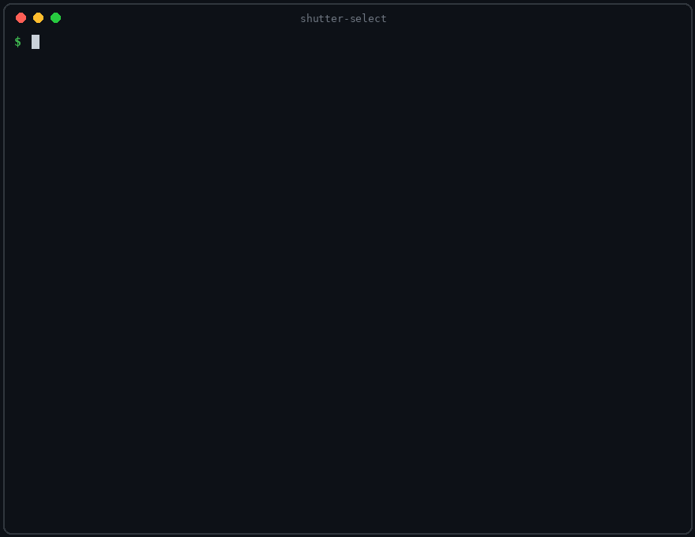

# shutter-select

[](https://github.com/keivanmalhani/shutter-select/actions/workflows/ci.yml)


English | [Espanol](README.es.md)



A local-first video culling engine. Point it at a folder of raw footage: it transcribes every word spoken, finds the takes, flags dead-quiet and clipped audio, scores sharpness, exposure, and motion, picks the strongest takes and b-roll, and hands your editor a ready-made selects timeline with color markers, plus SRT subtitles of everything said. Nothing ever leaves your machine.

## Why this exists

Editors burn hours on selects: scrubbing interviews for the good answer, hunting the sharp b-roll, discovering too late that the best take has clipped audio. Cloud tools exist for pieces of this, but raw client footage does not belong on someone else's servers, and standalone scene detectors stop at cut lists instead of finishing the job. shutter-select closes the gap between a card full of footage and the first edit: everything runs on your CPU, and the output opens directly in DaVinci Resolve or Premiere Pro.

## What it does

```text
walk  ->  transcribe  ->  segment  ->  measure  ->  score  ->  emit
```

1. **Walk.** Discovers video files under the root (symlink-safe). Dot files, `_` folders, and folders named "do not include" or "do not use" are always skipped.
2. **Transcribe.** [faster-whisper](https://github.com/SYSTRAN/faster-whisper) runs locally with voice activity detection. English and Spanish are both first-class; the language is auto-detected per file.
3. **Segment.** Speech is the primary structure: tripod interview footage has zero visual cuts, so scene detection alone finds nothing where it matters most. Continuous speech becomes a take (pauses of 1.5 s or more split takes), and only the regions with no speech are segmented by [PySceneDetect](https://github.com/Breakthrough/PySceneDetect) cuts. Every segment is classed as a speech take or b-roll.
4. **Measure.** Per segment: audio level, clipping, silence ratio, and a speech-to-noise margin from the waveform; sharpness (variance of the Laplacian), exposure clipping, and motion from sampled frames. Face presence is an optional extra (`--faces`).
5. **Score.** Every feature is percentile-ranked within the run and within its class, so each shoot is judged against itself, never against brittle absolute thresholds. Takes are weighted toward audio quality; b-roll toward sharpness and motion. Clipped or dead-quiet speech hard-fails with the reason attached.
6. **Emit.** The clear picks and clear drops get marked; the middle is left to your judgment. Out comes a selects timeline, a full stringout with green/red/yellow markers on every segment, SRT subtitles per file, a plain-text report, and a raw-feature JSON per file for downstream tooling.

## What you get

| File | What it is |
| --- | --- |
| `selects.otio` | The picked takes and b-roll as one timeline. Opens natively in DaVinci Resolve. |
| `stringout.otio` | Every segment in order with a green, red, or yellow marker: the engine's full reasoning, visible on a timeline. |
| `selects.fcp7.xml` | The selects timeline for Premiere Pro import. |
| `selects.edl` | Cuts-only CMX 3600 fallback (EDL barely supports markers; documented, not worked around). |
| `transcripts/*.srt` | Subtitles of everything said, per source file. |
| `transcripts/transcript.json` | The full transcript with timings (word-level with `--words`). |
| `report.txt` | Every decision with its reason, plus how much footage you actually need to review now. |
| `cache/*.json` | Raw per-segment features per file. Re-runs skip unchanged files; other tools can re-rank without re-analyzing. |

## Install

Requires Python 3.11+ and [ffmpeg](https://ffmpeg.org/download.html).

```bash
brew install ffmpeg            # macOS
```

```bash
sudo apt install ffmpeg        # Debian/Ubuntu
```

Not on PyPI yet (see Roadmap). Install from source:

```bash
git clone https://github.com/keivanmalhani/shutter-select.git
cd shutter-select
python -m venv .venv && source .venv/bin/activate
pip install -e .
```

## Usage

List the footage and formats. Read-only, instant:

```bash
shutter-select scan ~/footage/canyon_shoot
```

First run: analyze plus emit in one shot, allowing the one-time whisper model download:

```bash
shutter-select run ~/footage/canyon_shoot --allow-download
```

Re-tune thresholds instantly without re-analyzing (analysis is cached per file):

```bash
shutter-select emit ~/footage/canyon_shoot --select-percentile 0.75
```

Then open `_selects/selects.otio` in Resolve (File > Import > Timeline), or `_selects/selects.fcp7.xml` in Premiere. Markers carry the score, the reasons, and a transcript snippet.

### Options

| Flag | Default | What it does |
| --- | --- | --- |
| `--model NAME` | small | Whisper size: tiny, base, small, medium. |
| `--allow-download` | off | Permit the one-time model download, the only network access that exists. |
| `--profile P` | auto | Weight profile: auto, interview, event, broll. |
| `--words` | off | Store word-level timestamps (for caption tooling). |
| `--faces` | off | Face presence scoring via YuNet (one-time sha256-verified download). |
| `--take-gap S` | 1.5 | Silence gap in seconds that splits two takes. |
| `--scene-threshold T` | 27 | PySceneDetect sensitivity for b-roll regions. |
| `--select-percentile` | 0.60 | How choosy picks are (higher = fewer picks). |
| `--out DIR` | root/_selects | Where everything is written. |

## Model weights policy

Nothing is vendored, nothing is fetched silently. Whisper models resolve from Hugging Face into a local cache the first time you pass `--allow-download`; the face detector is a single ONNX file verified against the sha256 pinned in [MODEL_MANIFEST.json](MODEL_MANIFEST.json) before it is ever cached. Without the flag and without a cached model, the tool tells you exactly what to do; it never downloads on its own.

## Security model

- **Local only.** No uploads, no accounts, no telemetry, no analytics.
- **No network at runtime.** The single exception is the explicit, opt-in model download above.
- **Sources are opened read-only.** Every write lands under `_selects/` (or `--out`); source files are never modified.
- **Symlink-safe walks.** A planted symlink cannot pull footage from outside the root you named.
- **Skip rules always on.** Folders named "do not include" or "do not use" are excluded at any depth, so a do-not-touch folder on a client drive stays untouched.

## Honest limitations

- The speech-to-noise margin is a heuristic (loud-part level over quiet floor), not a calibrated SNR measurement.
- Segment loudness is RMS dBFS, not LUFS (file-level integrated LUFS is stored per file).
- A scene cut never splits a continuous speech take in this version.
- Scoring is a ranking signal to accelerate your judgment, not a replacement for it. The stringout timeline exists so you can audit every call.

## Development

```bash
pip install -e ".[dev]"
pytest
```

61 unit tests, no committed media fixtures: test footage is synthesized with ffmpeg at run time. One end-to-end test runs real whisper transcription behind `-m integration` and stays out of CI. CI runs Python 3.11 and 3.12 with ffmpeg installed.

## Family

Part of a local-first photo and video tooling family: [shutter-cull](https://github.com/keivanmalhani/shutter-cull) culls photo shoots into Lightroom-ready picks, [shutter-mcp](https://github.com/keivanmalhani/shutter-mcp) exposes photo libraries to AI agents read-only. shutter-select's per-file analysis JSON is a stable contract (`schema_version`), built to power social clip ranking next.

## Roadmap

- Single-pass frame sampler for faster 4K analysis
- Speaker diarization, filler-word flagging
- Caption-ready exports built on `--words`
- PyPI publish
- Social clip ranking on top of the analysis JSON

## License

MIT, see [LICENSE](LICENSE).
